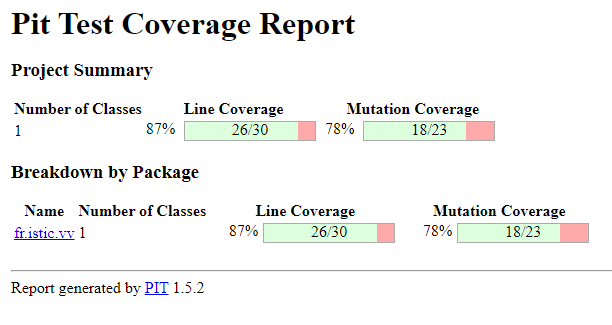

# Balanced strings

A string containing grouping symbols `{}[]()` is said to be balanced if every open symbol `{[(` has a matching closed symbol `]}` and the substrings before, after and between each pair of symbols is also balanced. The empty string is considered as balanced.

For example: `{[][]}({})` is balanced, while `][`, `([)]`, `{`, `{(}{}` are not.

Implement the following method:

```java
public static boolean isBalanced(String str) {
    ...
}
```

`isBalanced` returns `true` if `str` is balanced according to the rules explained above. Otherwise, it returns `false`.

Use the coverage criteria studied in classes as follows:

1. Use input space partitioning to design an initial set of inputs. Explain below the characteristics and partition blocks you identified.
2. Evaluate the statement coverage of the test cases designed in the previous step. If needed, add new test cases to increase the coverage. Describe below what you did in this step.
3. If you have in your code any predicate that uses more than two boolean operators check if the test cases written so far satisfy *Base Choice Coverage*. If needed add new test cases. Describe below how you evaluated the logic coverage and the new test cases you added.
4. Use PIT to evaluate the test suite you have so far. Describe below the mutation score and the live mutants. Add new test cases or refactor the existing ones to achieve a high mutation score.

Write below the actions you took on each step and the results you obtained.
Use the project in [tp3-balanced-strings](../code/tp3-balanced-strings) to complete this exercise.

## Answer
1. En entrée, on distingue plusieurs blocs séparés par un espace. Chaque bloc est composé par 2 caractères dont l'utilité est respectivement d'ouvrir et de fermer la <i>balance</i>.
   On aura donc i j pour S<sub>ij</sub> où S est la chaîne de caractères, i est l'ouverture et j la fermeture. Par exemple S<sub>()</sub> S<sub>[]</sub> S<sub>{}</sub> pour le
   dictionnaire de l'énoncé ```() [] {}```.

2. En utilisant l'outil de <i>Coverage</i> de l'IDE Inteli J, après avoir fait tourner tous les tests de base (nommés isBalancedTest_<i>n</i>) on peut voir que presque tout le code est parcouru. Le code
   non parcouru n'est que la gestion des exéptions retournées en cas d'erreur d'entrée.
   Pour agrandir la couverture des test on ajoute donc les tests gérant les exceptions ( isBalancedExceptionTest_<i>n</i> ). En réitérant la méthode pour voir la couverture des tests, on voit que presqe
   tout est couvert sauf les ```getMessage()``` des Exception, dont nous n'avons explicitement pas besoin, donc tout vas bien!
3. Pour évaluer la couverture des tests au sein d'une condition disposant de plusieurs opérateurs booléens, il faut tester chaque cas possible, à savoir:
   - Quand chaque condition est respectée
   - Quand chaque condition n'est pas respectée
   - Quand elles sont indépendamment les unes des autres respectées ou non.
   
   Ce qui nous donne 2<sup>nb conditions</sup> nombre de tests. Il faut en exclure un certain nombre pour les tests qui vérifie plusieurs conditions.
4. En utilisant PIT, on obtient les résultats suivants:
```
   # Mutations
   1. changed conditional boundary → SURVIVED
   2. negated conditional → KILLED
   1. negated conditional → SURVIVED
   1. replaced boolean return with false for fr/istic/vv/StringUtils::isOpeningSymbol → KILLED
   1. replaced boolean return with false for fr/istic/vv/StringUtils::isClosingSymbol → KILLED
   2. replaced boolean return with true for fr/istic/vv/StringUtils::isClosingSymbol → KILLED
   1. replaced boolean return with true for fr/istic/vv/StringUtils::isCorrespondingSymbol → SURVIVED
   2. negated conditional → KILLED
   3. negated conditional → KILLED
   1. negated conditional → KILLED
   1. negated conditional → KILLED
   1. removed call to java/util/LinkedList::addLast → KILLED
   1. negated conditional → KILLED
   1. negated conditional → KILLED
   1. negated conditional → KILLED
   1. negated conditional → KILLED
   2. negated conditional → KILLED
   1. replaced boolean return with false for fr/istic/vv/StringUtils::isBalanced → KILLED
   2. replaced boolean return with true for fr/istic/vv/StringUtils::isBalanced → KILLED
   1. replaced return value with "" for fr/istic/vv/StringUtils$EmptyInitialSetException::getMessage → NO_COVERAGE
   1. replaced return value with "" for fr/istic/vv/StringUtils$SymbolNotInSetException::getMessage → NO_COVERAGE
   1. replaced return value with "" for fr/istic/vv/StringUtils$WrongInitialSetException::getMessage → NO_COVERAGE
   
   # Active mutators
      BOOLEAN_FALSE_RETURN
      BOOLEAN_TRUE_RETURN
      CONDITIONALS_BOUNDARY_MUTATOR
      EMPTY_RETURN_VALUES
      INCREMENTS_MUTATOR
      INVERT_NEGS_MUTATOR
      MATH_MUTATOR
      NEGATE_CONDITIONALS_MUTATOR
      NULL_RETURN_VALUES
      PRIMITIVE_RETURN_VALS_MUTATOR
      VOID_METHOD_CALL_MUTATOR
```
